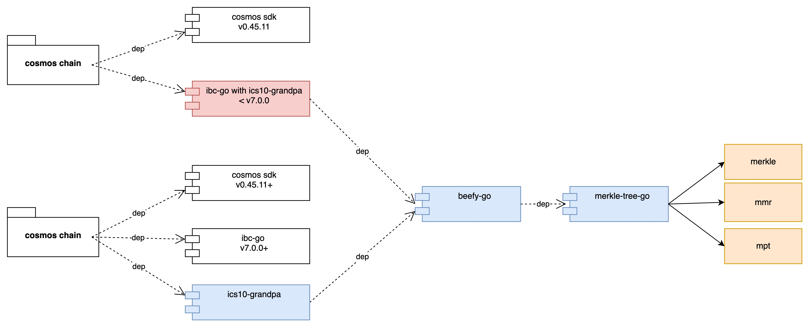

The [ICS-10 Grandpa Light Client](https://github.com/cosmos/ibc/blob/main/spec/client/ics-010-grandpa-client/README.md) implementation.  

This light client is available for versions below ibc-go v7.0.0, for ibc-go v7.0.0+ environments, please refer to this [repository](https://github.com/octopus-network/ics10-grandpa-go)  

 