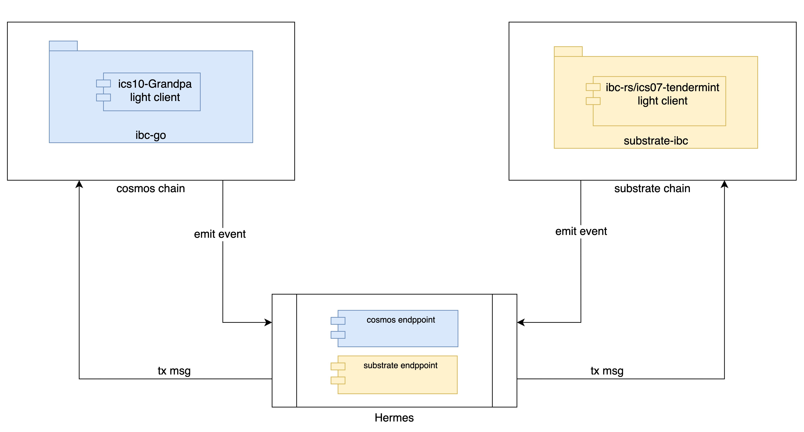
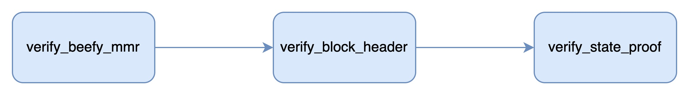

  

### About ICS10 Grandpa Light client  

This module contains the implementation of the ics10 spec, for the ics10 spec, please refer [here](https://github.com/cosmos/ibc/blob/main/spec/client/ics-010-grandpa-client/README.md)  
The ics10 grandpa light client relies on the substrate beefy feature to complete the verification, for more about beefy, please refer [here](https://github.com/paritytech/grandpa-bridge-gadget/blob/master/docs/beefy.md).  

#### The ICS10 light client verification process  

### TODO  

* light client upgrade
* check and handle misbehaviour
